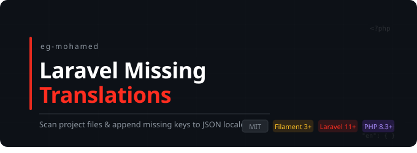

[](https://packagist.org/packages/eg-mohamed/laravelmissingtranslations)
[](https://packagist.org/packages/eg-mohamed/laravelmissingtranslations)

A Laravel dev-tool that scans your project for translation function calls and appends any missing keys to your JSON locale files. No more manually hunting for untranslated strings.

Supported Laravel versions: 11, 12, and 13.

Supports `__()`, `trans()`, `trans_choice()`, `@lang()`, `@choice()`, and `Lang::get/has/choice()`.

## Installation

Install as a dev dependency:

```bash
composer require eg-mohamed/laravelmissingtranslations --dev
```

Publish the config file:

```bash
php artisan vendor:publish --tag="laravelmissingtranslations-config"
```

## Configuration

```php
// config/laravelmissingtranslations.php

return [
    // Directories to scan
    'paths' => [app_path(), resource_path('views')],

    // File extensions to include
    'extensions' => ['php', 'blade.php'],

    // Directories to exclude from scanning
    'exclude_paths' => [],

    // Sort keys alphabetically in the JSON output
    'sort_keys' => true,

    // Skip dotted keys like 'auth.failed' (PHP array-based translations)
    'exclude_dot_keys' => false,

    // Translation functions to detect
    'include_functions' => ['__', 'trans', 'trans_choice', '@lang', '@choice', 'Lang::get', 'Lang::has', 'Lang::choice'],

    // Regex patterns for keys to skip
    'exclude_patterns' => [],

    // Flags passed to json_encode when writing locale files
    'json_flags' => JSON_PRETTY_PRINT | JSON_UNESCAPED_UNICODE,
];
```

## Usage

### Scan and write missing keys

```bash
php artisan missing-translations en
```

This scans your project, compares found keys against `lang/en.json`, and appends any missing ones with an empty string value.

If no locale argument is provided and `--all` is not used, the command falls back to `config('app.locale')` automatically:

```bash
php artisan missing-translations
```

### Preview without writing

```bash
php artisan missing-translations en --dry-run
```

Displays a table of missing keys without modifying any files. Also shows summary statistics:

```
Keys scanned: 42 | Existing: 38 | Missing: 4
Dry run mode: no changes written.
```

### Process all existing locale files at once

```bash
php artisan missing-translations --all
```

Runs the scan against every `lang/*.json` file found in your project. If no JSON files exist, a helpful message is shown instead of a generic error.

### Remove unused keys

```bash
php artisan missing-translations en --remove-unused
```

Finds keys that exist in `lang/en.json` but are no longer referenced in any scanned file, displays them, and removes them. Combine with `--dry-run` to preview without making changes:

```bash
php artisan missing-translations en --remove-unused --dry-run
```

### JSON output for CI pipelines

```bash
php artisan missing-translations en --json
```

Outputs results as JSON to stdout instead of the table format. Useful for CI pipelines — e.g. fail a build if missing translations count > 0:

```json
{
    "locale": "en",
    "existing_count": 38,
    "missing_count": 4,
    "missing_keys": [
        "New Key One",
        "New Key Two"
    ]
}
```

With `--remove-unused`:

```json
{
    "locale": "en",
    "existing_count": 38,
    "missing_count": 4,
    "missing_keys": ["New Key One"],
    "unused_count": 2,
    "unused_keys": ["Old Key", "Stale Key"]
}
```

## How it works

1. Uses Symfony Finder to crawl configured `paths` for files matching configured `extensions`
2. Extracts translation keys via regex from all supported function calls
3. Diffs found keys against the existing locale JSON file
4. Appends missing keys with an empty string value, leaving existing translations untouched
5. Re-running the command is safe — no duplicates are ever added
6. File writes use `LOCK_EX` to prevent corruption from concurrent runs

## Changelog

Please see [CHANGELOG](CHANGELOG.md) for more information on what has changed recently.

## Contributing

Please see [CONTRIBUTING](CONTRIBUTING.md) for details.

## Security Vulnerabilities

Please review [our security policy](../../security/policy) on how to report security vulnerabilities.

## Credits

- [Mohamed Said](https://github.com/EG-Mohamed)
- [All Contributors](../../contributors)

## License

The MIT License (MIT). Please see [License File](LICENSE.md) for more information.
